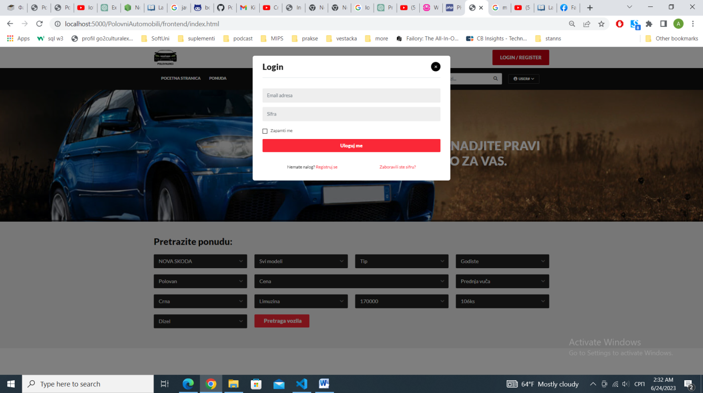
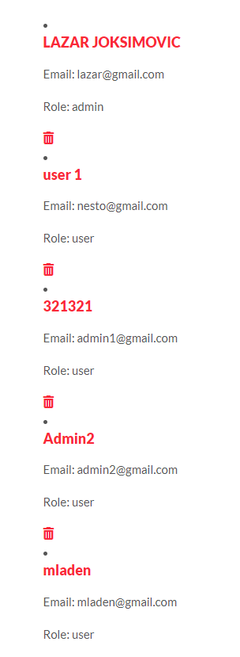

**Универзитет у Крагујевцу**

**Факултет инжењерских наука**

**Софтверски инжењеринг 2**

**Апликација за продају половних аутомобила**

Тим: Предметни наставник:

Марија Бажалац 587/2016 Проф. Др Велибор Исаиловић

Милица Денић 635/2017

Лазар Јоксимовић 635/2019

Ана Стефановић 635/2019

Младен Цветковић 649/2019

Крагујевац, Јул 2023.

Садржај:

[1. Опис пројекта](#1-опис-пројекта)

[2. Коришћене технологије](#2-коришћене-технологије)

[2.1. MongoDB](#21-mongodb)

[2.2. Express](#22-express)

[2.3. Node.js](#23-nodejs)

[2.4. JavaScript/JQuery](#)

[2.5 Modelio](#25-modelio)

[3. UML дијаграми](#3-uml-дијаграми)

[3.1. Дијаграм случајева коришћења (Use-case)](#31-дијаграм-случајева-коришћења-use-case)

[3.2. Дијаграм секвенци](#32-дијаграм-секвенци)

[4. Шема докумената](#4-шема-докумената)

[5. Опис коришћења апликације](#5-опис-коришћења-апликације)

[6. Литература](#6-литература)

# 1. Опис пројекта

У овом пројекту је потребно развити апликацију за продају половних аутомобила. Апликација омогућује приказ тренутне понуде аутомобила.

Понуди аутомобила може приступити било ко путем интерфејса апликације:

1.  Администратор
2.  Корисник

**Администратор** апликације има могућност одобравања нових огласа које су корисници доставили и управљања комплетним садржајем апликације.

Омогућена је регистрација **корисника** који регистрацијом добијају додатне могућности:

-   Постављање огласа
-   Могућност да одређене претраге сачувају, које могу на једноставан начин да покрену

Апликација треба да омогући претрагу и приказ аутомобила по задатим критеријумима:

-   марка возила
-   тип возила
-   година производње
-   пређени километри
-   цена
-   врста погона
-   врста мењача

# 2. Коришћене технологије

При изради пројекта су коришћене следеће технологије:

-   MongoDB – база
-   Express – рутирање
-   Node.js – backend
-   JavaScript/JQuery – frontend

За моделирање UML дијаграма је коришћен Modelio.

## 

## 2.1. MongoDB

MongoDB је водећа [NoSQL](https://sr.wikipedia.org/w/index.php?title=NoSQL&action=edit&redlink=1) база података. У складу са растућим интересовањем за алтернативне системе за управљање базама података, који се разликују од традиционалних релационих база података, појавио се концепт такозваних [NoSQL](https://sr.wikipedia.org/w/index.php?title=NoSQL&action=edit&redlink=1) база података, које не користе SQL за повезивање, нерелационе су, дистрибуиране, отвореног кода и хоризонтално скалабилне. Написана је у [C++](https://sr.wikipedia.org/wiki/C%2B%2B) језику и отвореног је кода, издата под комбинацијом [GNU Affero General Public License](https://sr.wikipedia.org/w/index.php?title=GNU_Affero_General_Public_License&action=edit&redlink=1) i [Apache License](https://sr.wikipedia.org/w/index.php?title=Apache_License&action=edit&redlink=1). MongoDB чува податке као JSON документе са динамичким шемама. JSON (*JavaScript Object Notation*) је отворени стандард заснован на тексту, осмишљен за размену података који су погодни за читање људима. MongoDB је прихваћен као бекенд софтвер бројних значајних веб-сајтова и сервиса, укључујући [Craigslist](https://sr.wikipedia.org/w/index.php?title=Craigslist&action=edit&redlink=1), [eBay](https://sr.wikipedia.org/wiki/%D0%98%D0%B1%D0%B5%D1%98), [Foursquare](https://sr.wikipedia.org/wiki/Foursquare), [SourceForge](https://sr.wikipedia.org/w/index.php?title=SourceForge&action=edit&redlink=1) и [New York Times](https://sr.wikipedia.org/wiki/%D0%8A%D1%83%D1%98%D0%BE%D1%80%D0%BA_%D1%82%D0%B0%D1%98%D0%BC%D1%81).

## 2.2. Express

Express језик, познат и као Express.js или само Express, је популаран web framework за развој апликација помоћу Node.js платформе. Он пружа једноставан и ефикасан начин за изградњу веб апликација и API-ја. Express је дизајниран да буде минималистички и флексибилан, пружајући само основне функционалности за изградњу web апликација. То омогућава програмерима да сами одаберу и интегришу додатне модуле према потребама њиховог пројекта. Express омогућава дефинисање рутирања, што омогућава одговарајућу обраду захтева на основу URL-ова и HTTP метода. Ово олакшава организацију рута и контролисање како ће апликација реаговати на одређене захтеве. Express користи middleware као кључни концепт. Middleware су функције које се извршавају између долазних захтева и одлазних одговора. Користе се за обављање различитих задатака као што су обрада захтева, аутентификација, обрада грешака и многе друге функционалности. Middleware омогућава модуларност и флексибилност у развоју апликација. Express се често користи за изградњу RESTful API- ја, једноставних веб апликација, као и за развој комплекснијих серверских апликација. Заједно са Node.js платформом, express омогућава програмерима да развијају високо скалабилне и ефикасне web апликације користећи JavaScript на серверској страни.

## 2.3. Node.js

Node.js је open-source, серверска платформа за извршавање JavaScript кода. Основна карактеристика Node.js -а је да омогућава извршавање JavaScripta изван веб прегледача, што значи да се може користити за изградњу серверских апликација. Node.js користи једнонитни модел са догађајима (event-driven model). То значи да се све операције извршавају асинхроно, без блокирања извршења других операција. Ова карактеристика чини Node.js веома ефикасним за обраду великог броја истовремених захтева са малим оптерећењем ресурса. Node.js долази са NPM-ом, који је највећи регистар библиотека и модула за JavaScript. NPM омогућава програмерима да лако преузму и управљају екстерним библиотекама и модулима који су потребни за њихове пројекте. Ово олакшава поновно коришћење кода, убрзава развој апликација и пружа широк спектар функционалности које се могу интегрисати у Node.js апликације. Node.js је постао популаран избор за развој серверских апликација због своје скалабилности, ефикасности и способности да се користи исти језик (JavaScript) и на серверској и на клијентској страни. Ова флексибилност омогућава програмерима да деле код, логику и библиотеке између сервера и клијената, чиме се олакшава развој комплексних и интерактивних веб апликација.

## 

## 2.4. JavaScript/JQuery

JavaScript је популаран програмски језик који се широко користи за развој динамичких и интерактивних веб страница. Он је основни језик за програмирање у веб прегледачима и омогућава интеракцију са HTML и CSS садржајем странице. JavaScript се извршава на клијентској страни, у веб прегледачу корисника. То значи да се код извршава директно на уређају корисника, што омогућава динамичко ажурирање и манипулацију веб страницом без потребе за слањем додатних захтева на сервер. JavaScript подржава објектно-оријентисано програмирање (ООП) парадигму, што омогућава организацију кода у објекте са својствима (properties) и методама (methods). Ово олакшава структурирање и поновно коришћење кода, као и рад са комплексним системима. JavaScript је динамички типизиран језик, што значи да типови података нису строго дефинисани приликом декларисања променљивих. Document Object Model (DOM) је представљен у JavaScriptu као структура која представља елементе и садржај веб странице. JavaScript омогућава манипулацију DOM-ом, што значи да се може динамички мењати садржај, стилови и интеракције елемената на страници. Постоје бројне библиотеке и framework-ови за Java Script који пружају додатне функционалности и олакшавају развој апликација. Једна од најпопуларнијих библиотека је jQuery, која олакшава манипулацију DOM-ом, анимације, обраду догађаја и комуникацију са сервером.

## 2.5 Modelio

Modelio је напредан алат за моделирање отвореног кода који се користи за визуелно моделирање софтвера, системско инжењерство, пословне процесе и друге врсте моделирања. Овај алат омогућава анализу, пројектовање и документовање различитих аспеката система. Modelio пружа интуитиван графички интерфејс за визуелно моделирање. Корисници могу да користе дијаграме и симболе како би представили различите аспекте система, укључујући структуру, понашање, процесе, архитектуру и друге релевантне елементе. Modelio подржава широк спектар дијаграма који се могу користити за моделирање софтвера и система. То укључује дијаграме класа, дијаграме активности, дијаграме случајева употребе, дијаграме секвенци, дијаграме компоненти, дијаграме стања и још много тога. Ови дијаграми омогућавају програмерима, аналитичарима и инжењерима да јасно представе структуру, логику и процесе система.

# 3. UML дијаграми

UML (Unified Modeling Language) је стандардни језик за визуелно моделирање софтвера који пружа нотацију и концепте за описивање различитих аспеката система. UML дијаграми се често користе за визуелизацију, пројектовање и документовање софтверских архитектура и система. UML дијаграми омогућавају тимовима и програмерима да јасно визуализују, комуницирају и документују архитектуру и функционалност система, чиме олакшавају развој софтвера и сарадњу међу члановима тима.

## 3.1. Дијаграм случајева коришћења (Use-case)

Дијаграм случајева коришћења приказује интеракцију корисника са системом и однос између корисника и различитих случајева коришћења у којима је корисник укључен. Случај коришћења је опис скупа секвенци акција, укључујући варијанте, које систем обавља да би произвео видљив резултат од вредности за појединог актера. Користи се да специфицира шта субјект ради, а не како ради. Основни елементи дијаграма су случајеви коришћења, актери, релације и пакети.

## 3.2. Дијаграм секвенци

Дијаграми секвенци су УМЛ дијаграми који се користе за приказивање интеракција између објеката у временском следу. Ови дијаграми пружају визуелни приказ тока порука и акција између објеката током одређеног сценарија или операције. Главни циљ дијаграма секвенци је приказати динамичко понашање система. Ево неколико кључних елемената и конвенција које се користе у дијаграмима секвенци:

**Објекти**: Објекти су ентитети који комуницирају међусобно. Они се представљају као правоугаоници са именима објеката унутар њих. Објекти су обично инстанце класа или компоненти система.

**Животни циклус објекта**: Животни циклус објекта приказује период када је објекат активан и када није. То се обично приказује вертикалном линијом која представља животни циклус објекта током времена. Објекат је активан када је линија присутна, док је неактиван када линија није присутна.

**Поруке**: Поруке су комуникацијске акције између објеката. Оне приказују размену информација, позиве метода или слање сигнала између објеката. Поруке се представљају стрелицама уперене од једног објекта ка другом, са назнаком врсте поруке (synchronous- синхрона, asynchronous - асинхрона или return - повратна).

**Животна трака**: Животна трака је простор на дијаграму секвенци који представља временски интервал током којег се објекти активно укључују у интеракцију. Животна трака се обично представља хоризонталном линијом испод или изнад објеката.

**Активација**: Активација представља временски период током којег објекат обавља одређену акцију или извршава одређену методу. Активација се означава вертикалном цртом или правоугаоницима унутар животне траке објекта.

Дијаграми секвенци су корисни за разумевање комплексних сценарија и међусобне интеракције објеката у систему. Они пружају јасан преглед редоследа порука и акција, као и идентификацију потенцијалних проблема или нејасноћа у комуникацији између објеката.

# 4. Шема докумената

MongoDB ради са документима уместо традиционалних табела које се користе у релацијским базама података. MongoDB је документ-оришентисана база података која чува податке у облику BSON (Бинарy JSON) докумената. Уместо да користи табеларну структуру са унапред дефинисаним шемама као што је то случај са релацијским базама података, MongoDB омогућава складиштење флексибилних JSON-сличних докумената. Документи се групишу у колекције (colections), а колекције се затим организују у базу података.

Ова флексибилност MongoDB-а омогућава лакше руковање са променљивим шемама података, јер сваки документ може имати различите сетове атрибута. Такође, MongoDB пружа богате могућности индексирања и подршку за напредне упите, што олакшава претрагу и манипулацију подацима.

# 5. Опис коришћења апликације

У овом делу је описана сама апликација као и опције које она нуди. Као што је задато, апликацији је могуће приступити на више начина (корисник без налога, пријављени корисник и админ) и са тим у вези су објашњене могућности које свака улога има.

На почетној страни апликације се налази претрага свих постављених огласа са пољима о различитим карактеристикама возила, као и најновији постављени огласи. Посетилац сајта може претраживати по жељи, опционим уписивањем/бирањем једне од опција из падајуће листе следећих информација о возилу:

-   Марка возила
-   Тип возила
-   Модел
-   Годиште
-   Цена
-   Километража
-   Каросерија
-   Стање
-   Боја
-   Погон
-   Гориво

Сајту је могуће приступити без корисничког налога, али и са већ креираним налогом. Уколико посетилац сајта жели да се пријави или да креира налог, то може урадити кликом на картицу ,,Login/Register”.

Уколико је изабрао да се пријави, појавиће се прозор са слике где се тражи мејл адреса и шифра.

За регистрацију је потребно попуњавање поља за име и презиме, мејл адресу и шифру.

На слици 17. су приказане могућности које корисник има.

Када је корисник пријављен на сајт има више могућности од којих је и подешавање профила као што је дат на слици.

Поред могућности пријављеног корисника да подеси свој профил, главна могућност је и постављање огласа где треба попунити податке који се траже за опис возила. Поред података могуће је поставити и слику возила. Страна за постављање огласа је дата на слици 19.

Као админ сајта постоје могућности управљања сајтом. Па тако админ мора одобрити оглас, који корисник жели да постави на сајт, како би он био приказан.

Админ има и могућност управљања корисницима, где може да обрише налоге постојећих корисника сајта.

# 6. Литература

1\. Материјали са moodle портала Факултета инжењерских наука: Софтверски инжењеринг

2\. Материјали са moodle портала Факултета инжењерских наука: Софтверски инжењеринг 2

3\. <https://www.mongodb.com/products/compass>

4\. <https://nodejs.org/en/about>

5\. <https://expressjs.com/en/guide/routing.html>
